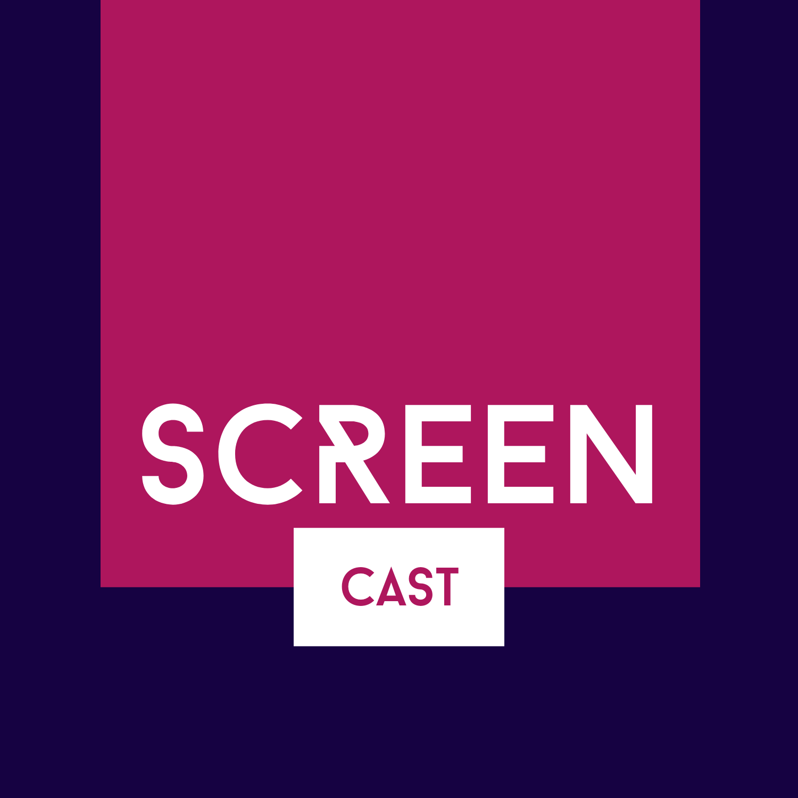
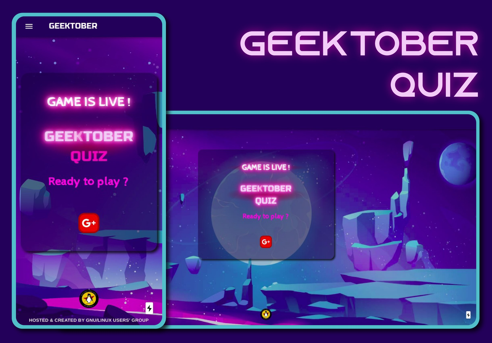

<p align="center">
  <a href="https://screencast.anweshadan.vercel.app/">
    
  </a>
</p>
<h1 align="center">
  SCREENCAST FRONTEND
</h1>

<p align="center"></p>

## Description

The official Screencast application frontend, created by GNU/Linux Users' Group, NIT Durgapur

## Project status

Under Development. Visit [https://screencast-zeta.vercel.app/](https://screencast-zeta.vercel.app/).

<h3>Application is dockerized<h3>

## Installation and usage

- Clone this repository
- Install all the dependencies by running this command

```
npm install
```

- Run the development Server

```
npm run dev
```

## License

[MIT](./LICENSE)
